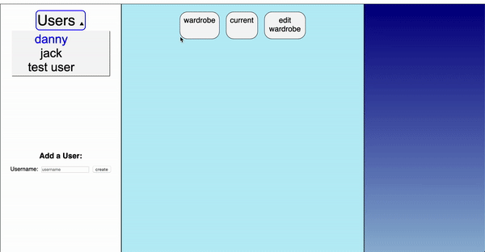
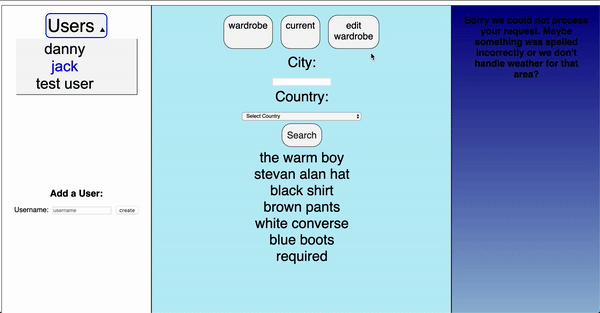

# Weather-ready 🌦👖

> A weather app that cares for your clothing. 


Users can join the app and quickly populate their wardrobe for outfit suggestions based on weather conditions


## Overview

Users can access & edit their wardrobe for better clothing suggestions.

<b>Current Section:</b> Users can search for specific city locations for weather overlook and clothing suggestions.
In case of multiple cities with the same name, users can be more specific by selecting a country.



<b>Wardrobe: </b>
Users can rapidly edit and expand their wardrobe by browsing the clothing available on the app database.



## Technologies
<ul>
<li />JavaScript - Client
<li />Ruby on Rails - Backend
<li />Postgresql
<li />HTML/CSS
<li />Open Weather Map Api - Weather Data
</ul>


### Getting Started
These instructions will get you a copy of the project up and running on your local machine for development and testing purposes.
##### Prerequisites
<ul>
<li /> Ruby
<li /> Postgresql
<li /> Open Weather API Key
</ul> 

##### Running


1. Clone/Download Repo.
2. move into project ``` cd backend-api```
3. run rails server on localhost port 3000.
    ```sh 
    rails server -p 3000
    ```
4. go back to main directory and move to client ``` cd client```.
5. open index.html on your preferred browser.


## Meta

Danny Brito – [LinkedIn](https://www.linkedin.com/in/dannybrito) - [Github](https://github.com/DannyBrito)
